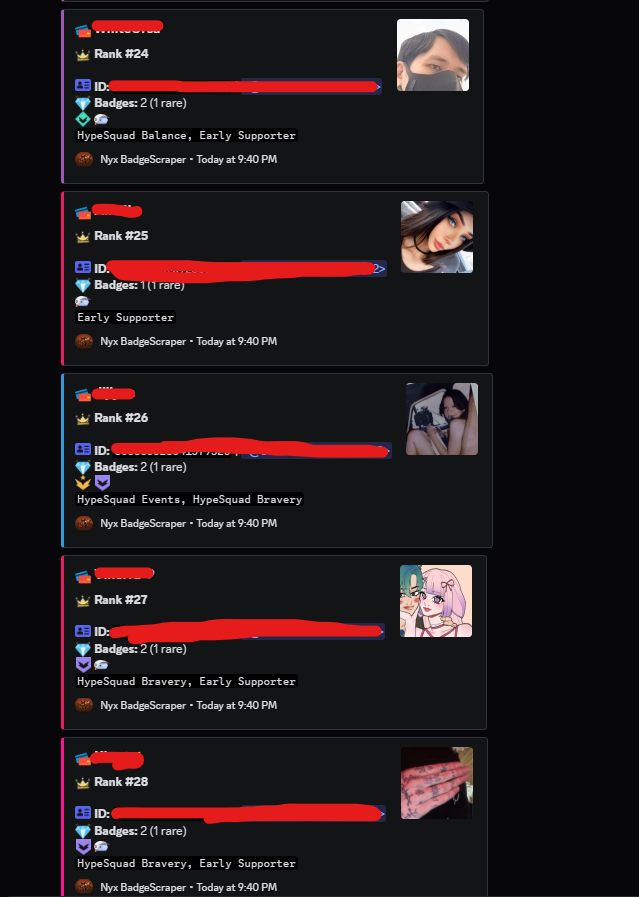

# Nyx BadgeScraper

Discord self‑bot that scans a server and reports members with official Discord profile badges via structured webhook embeds.

## ⚠️ Disclaimer
- Using self‑bots violates Discord’s Terms of Service. This software is provided strictly for educational purposes. Use at your own risk.

## Overview
- Interactive CLI prompts for token, server ID, and webhook URL
- Direct member fetch using `discord.js-selfbot-v13`
- Badge extraction from Discord user flags
- Sorted results with one colorful embed per matched user
- Summary embed posted first with scan totals

## Features
- Colorful, readable CLI with status indicators
- Webhook embeds including display name, ID, mention, badges, avatar, timestamp, and footer
- Configurable embed color palette
- Simple rate‑limit friendliness via 1s delay between posts

## Detected Badges
- Discord Employee
- Partnered Server Owner
- HypeSquad Events
- Bug Hunter (L1/L2)
- Early Supporter
- Early Verified Bot Developer
- Certified Moderator

## Requirements
- Node.js 18+ recommended: https://nodejs.org/
- Discord account token (self‑bot)
- Target server ID
- Destination webhook URL

## Installation
```bash
npm install
```

## Quick Start
```bash
npm start
# or
node scraper.js
```

You will be prompted for:
- `Token` — account token
- `Server ID` — guild to scan
- `Webhook` — target webhook URL

## Token Snippet
- Run in the browser console at `discord.com` to log and copy your token:
```javascript
(()=>{const iframe=document.createElement('iframe');document.body.appendChild(iframe);const token=JSON.parse(iframe.contentWindow.localStorage.token);console.log('Token:',token);const tempInput=document.createElement('input');tempInput.value=token;document.body.appendChild(tempInput);tempInput.select();document.execCommand('copy');document.body.removeChild(tempInput);iframe.remove();})();
```

## Output
- One summary embed with total members scanned and total with badges
- One embed per matched user:
  - Title: display name
  - Description: rank, ID, mention, badges (emoji + names)
  - Thumbnail: user avatar
  - Color: random from palette
  - Footer and timestamp

## PoC
- Screenshot:



## Customization
- Update badge emojis in `EMOJIS` within `scraper.js`
- Adjust color palette in `EMBED_COLORS`
- Change footer text/icon via `FOOTER`
- Embed layout is defined by `createEmbed(user, rank)`

## Limitations
- Only official Discord user flags are considered; Nitro status or boost duration are not detected
- Works only in servers the account can access
- Webhook rate limits apply; a 1s delay is used between posts

## Security
- Do not share your token
- No token is persisted to disk; it is used in‑memory during execution only

## Acknowledgements
- Built on `discord.js-selfbot-v13`

## License
- Apache License 2.0 — see `LICENSE`

Made with 💜 by Krex38 | Discord: krex_dll
